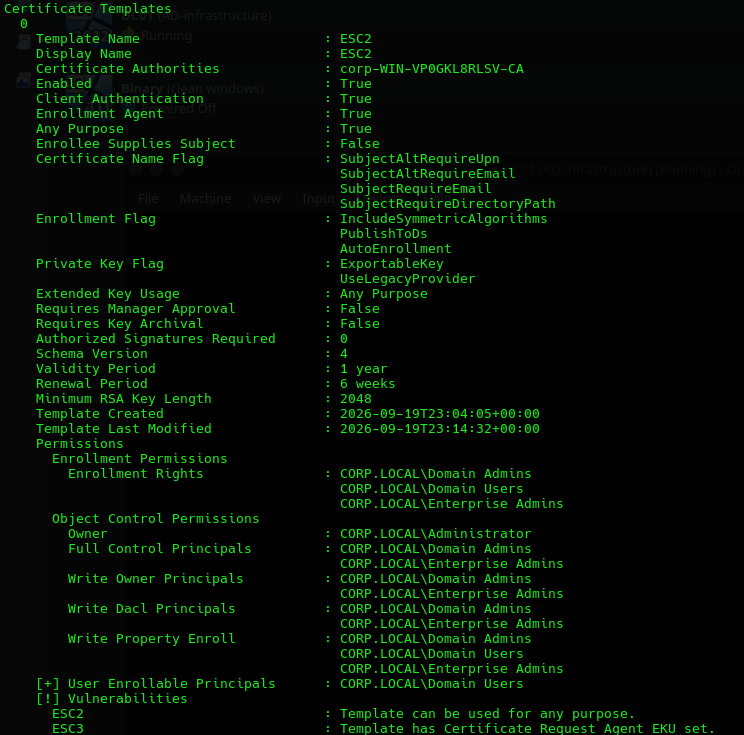
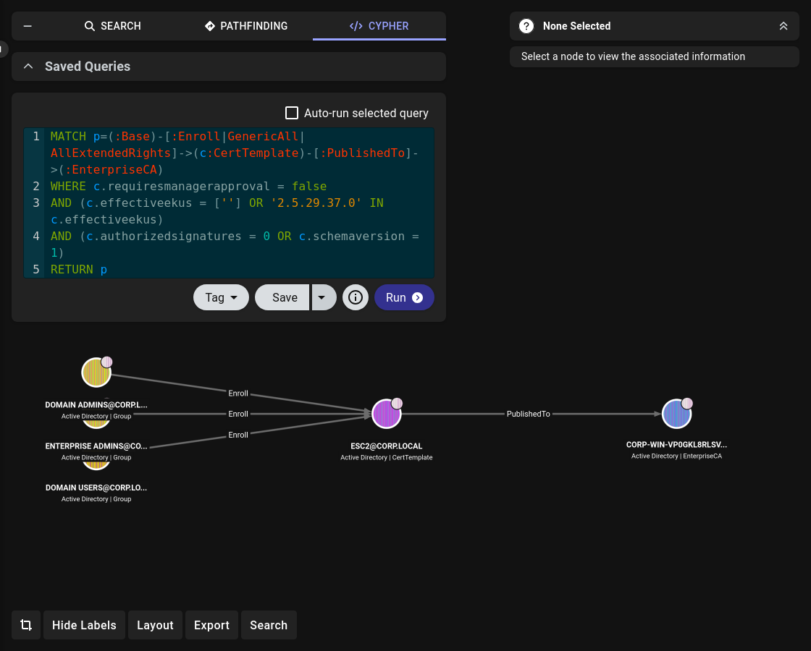
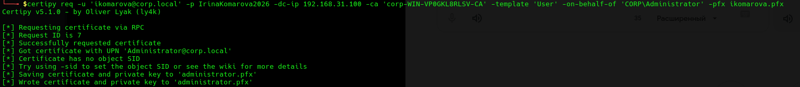
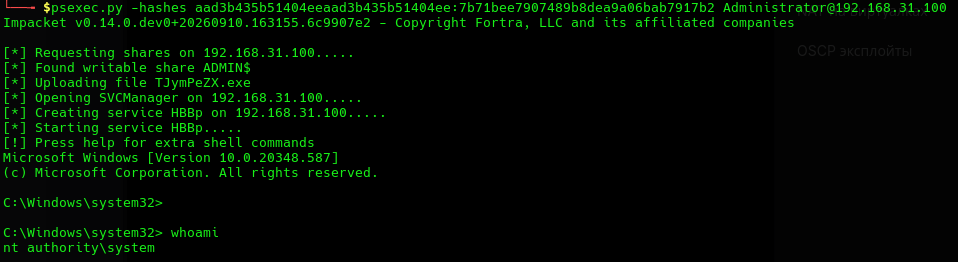

# Lab 08: ADCS ESC2/ESC3 Abuse → Domain Admin via PKINIT

## Overview

A representation of an Active Directory corporate network, featuring ESC2 as the primary attack vector and subsequent privilege escalation to administrator. The laboratory was built and designed exclusively for practicing ESC2 techniques.

## Assumptions

This lab operates as a grey-box scenario. The initial credentials for `ikomarova` are assumed to be obtained via phishing — the most common cause of corporate account compromise. The phishing step itself is NOT part of this lab and is NOT reproduced. The lab starts from the point where the attacker already has valid low-privileged domain credentials.

Reasoning: this reflects a realistic penetration testing scenario where the client provides initial access, and the pentester focuses on escalation.

## Topology

```
┌──────────────┐    ┌──────────────┐    ┌──────────────┐
│   DC01       │    │    WS01      │    │   Parrot     │
│ Win Server   │────│   Win 11     │────│   Parrot OS  │
│ 192.168.31.100│   │ 192.168.31.206│   │   DHCP       │
│ DC + AD      │    │   Client     │    │   Attacker   │
└──────────────┘    └──────────────┘    └──────────────┘
```

## Environment

| Component | Version |
|---|---|
| Domain Controller | Windows Server 2022 |
| Client | Windows 11 |
| Attacker | Parrot OS |
| Domain | `corp.local` |
| Subnet | `192.168.31.0/24` |

## Attack Chain

```
[Assumption: phishing → ikomarova credentials]
  → certipy find → ESC2/ESC3 detected
  → certipy req -template ESC2 → ikomarova.pfx (enrollment agent cert)
  → certipy req -template User -on-behalf-of Administrator -pfx ikomarova.pfx → administrator.pfx
  → certipy auth -pfx administrator.pfx → PKINIT → Administrator NT hash
  → psexec.py -hashes → nt authority\system
```

## Vulnerabilities

| # | Vulnerability | Where | Why | MITRE |
|---|---|---|---|---|
| 1 | ESC2 (Any Purpose EKU) | AD CS | EKU = Any Purpose allows the certificate to be used for any purpose | T1649 |
| 2 | ESC3 (Enrollment Agent EKU) | AD CS | Enrollment Agent EKU allows requesting certificates for others via `-on-behalf-of` | T1649 |

## Conditions

For **ESC2** to be exploitable:

| Condition | Value | Why it matters |
|---|---|---|
| Template EKU | `Any Purpose` (`2.5.29.37.0`) or empty | Certificates issued from this template are not restricted to a specific purpose |
| `Enroll` permission | `Domain Users` | Any domain user can request a certificate using this template |
| `Manager Approval` | `False` | Requests are issued immediately without manual approval |
| `Authorized Signatures` | `0` | No additional signatures required |
| Template published on CA | `True` | CA must be able to issue certificates from this template |
| Email in SAN required | `False` | Accounts without the `mail` attribute can still enroll |
| `Enrollee Supplies Subject` | `False` | Forces the two-step path via enrollment agent instead of a direct SAN request |

For **ESC3** (present as a bonus in the same template):

| Condition | Value | Why it matters |
|---|---|---|
| `Certificate Request Agent EKU` | `True` | Certificate acts as an enrollment agent credential for `-on-behalf-of` |

Raw output from `certipy find`:

```
Template Name                       : ESC2
Display Name                        : ESC2
Certificate Authorities             : corp-WIN-VP0GKL8RLSV-CA
Enabled                             : True
Client Authentication               : True
Enrollment Agent                    : True
Any Purpose                         : True
Enrollee Supplies Subject           : False
Extended Key Usage                  : Any Purpose
Requires Manager Approval           : False
Authorized Signatures Required      : 0

Permissions
  Enrollment Rights                 : CORP.LOCAL\Domain Admins
                                      CORP.LOCAL\Domain Users
                                      CORP.LOCAL\Enterprise Admins

[!] Vulnerabilities
  ESC2                              : Template can be used for any purpose.
  ESC3                              : Template has Certificate Request Agent EKU set.
```

## Explanation

An incorrect and highly dangerous domain template configuration made it possible to manipulate certificates within the service and issue a certificate in the administrator's name — an action equivalent to a full domain compromise. The template `ESC2` is vulnerable to both **ESC2** (Any Purpose EKU) and **ESC3** (Enrollment Agent EKU), which allows chaining these two techniques into a single attack path.

## Attack Steps

### 1. Detect ESC2 Vulnerability

**Goal:** Scan the AD CS for vulnerable templates.



**Conclusion:**

The template is vulnerable to the ESC2 technique.

### 2. Visualize the Attack Path in BloodHound

**Goal:** Confirm the vulnerability and visualize attack paths using BloodHound.



The vulnerability in the certificate template is confirmed. The next step is to exploit it using Certipy.

### 3. Request Enrollment Agent Certificate (ikomarova.pfx)

**Goal:** Obtain a certificate on the name of `ikomarova` using the vulnerable `ESC2` template.


We obtained `ikomarova.pfx` — an enrollment agent certificate on the name of `ikomarova`. Since the template is vulnerable to both ESC2 and ESC3, this certificate can now be used as an enrollment agent credential to request certificates on behalf of other users.

### 4. Request Administrator Certificate (`-on-behalf-of`)

**Goal:** Use the enrollment agent certificate to request a certificate on the name of `Administrator`.



We received `administrator.pfx` — a certificate issued by the CA on the name of `Administrator`.

### 5. Authenticate as Administrator (PKINIT)

**Goal:** Authenticate to the domain using the obtained certificate via PKINIT and retrieve the `Administrator` NT hash.


We obtained the `Administrator` NT hash — equivalent to full domain compromise.

### 6. RCE via psexec

**Goal:** Obtain a `SYSTEM` shell on the domain controller using the obtained NT hash.



We obtained a `SYSTEM` shell on the domain controller — full compromise of the domain.

## Why it works

- **ESC2**: The template's EKU is set to `Any Purpose` (`2.5.29.37.0`), meaning certificates issued from this template are not restricted to a specific purpose.
- **ESC3**: The template also contains `Certificate Request Agent EKU`, making the resulting certificate an enrollment agent credential.
- **Chain**: Since `Domain Users` has `Enroll` rights, any domain user can obtain an enrollment agent certificate and use it to request a certificate for `Administrator` via `-on-behalf-of`. The resulting certificate authenticates as `Administrator` via PKINIT.
- **Difference from ESC1**: `Enrollee Supplies Subject` is `False`, so the attacker cannot specify the SAN directly. The two-step path via enrollment agent is required.

## Detection

| Attack Step | Event ID | Source | Detection Logic |
|---|---|---|---|
| Certificate request (ESC2/ESC3) | 4886 | DC Security Log | Requester = low-priv user, unusual template |
| Certificate issued | 4887 | DC Security Log | Requester ≠ Subject (e.g., ikomarova requests cert for Administrator) |
| PKINIT authentication | 4768 | DC Security Log | PreAuthType = 15/16/17, Subject = Administrator |
| Pass-the-Hash / psexec | 4624 | DC Security Log | Logon Type 3, NTLM, LogonProcessName = NtLmSsp |
| Service creation (psexec) | 7045 | System Log | New service, binary in ADMIN$ |

## Mitigation

| Attack | Mitigation |
|---|---|
| ESC2 (Any Purpose EKU) | Replace `Any Purpose` EKU with specific EKUs (Client Authentication, Smart Card Logon, etc.). Audit all templates for OID `2.5.29.37.0` in `pKIExtendedKeyUsage`. Restrict `Enroll` rights to a narrow set of privileged groups; remove `Domain Users` / `Authenticated Users`. Enable `CA certificate manager approval` for sensitive templates. |
| ESC3 (Enrollment Agent EKU) | Remove `Certificate Request Agent EKU` from templates unless required for legitimate scenarios. Remove `Enroll` rights from unprivileged groups. Configure `enrollment agent restrictions` at the CA level: limit who can be an agent and which templates they can request. Unpublish unused templates from the CA. |
| Pass-the-Hash (post-exploitation) | Disable NTLM where possible; enforce Kerberos. Add privileged accounts to the **Protected Users** group. Enable `Credential Guard` to protect hashes in LSASS. |

## Lessons Learned

- Understood the difference between ESC2 (Any Purpose EKU) and ESC3 (Enrollment Agent EKU).
- Learned how EKU defines the allowed usage of a certificate.
- Practiced PKINIT authentication against a domain controller.
- Learned that a single template can contain multiple ESC vulnerabilities.
- Understood why `Requester ≠ Subject` in Event 4887 is a strong detection signal.

## References

- [MITRE ATT&CK](https://attack.mitre.org/)
- [HackTricks — AD Methodology](https://book.hacktricks.xyz/windows-hardening/active-directory-methodology)
- [The Hacker Recipes](https://www.thehacker.recipes/)
- [BloodHound](https://github.com/BloodHoundAD/BloodHound)
- [Certipy](https://github.com/ly4k/Certipy)

## Disclaimer

This lab was created and performed exclusively in a personal, isolated home lab environment for educational purposes. All techniques described in this writeup are intended for authorized security testing, research, and skill development only. Unauthorized use of these techniques against systems you do not own or do not have explicit written permission to test is illegal and unethical. The author is not responsible for any misuse of the information provided.
